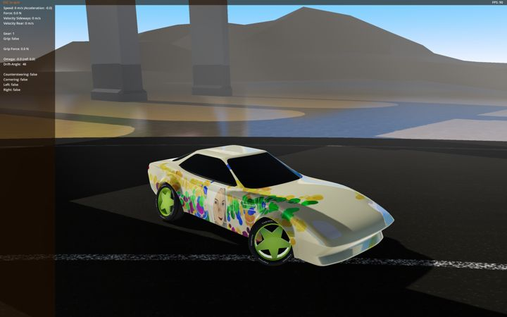

# DriftCarG4
This is a port of the [drift car project](https://notabug.org/tomaga/DriftCarProject) to Godot 4.

### Preview

To try out this project you first have to download the [Godot Engine](https://godotengine.org/). In Godot click the import button. Locate the folder "Drift Car". Then double click "project.godot". The project will be loaded. Once done you just have to click the play-button located at the top right corner.

### How to drift
The car has a behaviour which is called lift-off oversteer. This means when you turn the car and release the accelerator and then press it again, the car will enter drift mode. In drift mode you can make much tighter turns than normally. To leave drift mode you should counter steer until your car points to the desired direction.

### How it works
There is no friction model of the tires. Instead the drifting is modelled for an arcade-style experience. This means drifting should be easy to control for the player. There are a few PID-controllers that regulate the angular velocity of the car and the lateral forces of the tires. The omega controller regulates the angular velocity. The drift controller regulates the drift angle and the grip controller is responsible for the car to leave drift mode. There is also a steering controller which handles normal steering behaviour. When turning, an artificial torque is applied to the car, the steering torque. This has nothing to do with real life cars. A real car turns because forces act lateral on the front tires. This is purely an arcade-style model. To move the car a single force is applied to the body of the car. This also has nothing to do with real cars. We can now move the car and turn it (with the steering torque), but it looks totally unrealistic (like controlling a space ship in space or a boat on the water). To make it look more realistic, we simulate the lateral forces of the tires with our steering controller. The steering controller measures the sideways velocity of the car and adds a lateral force to the body of the car in order to reduce the sideways velocity. Now we can drive the car almost like a real car, but not at very low speeds. But that doesn't matter because we want a drift car, not a parking simulator. To make the car drift, we use the drift controller. This controller also adds a lateral force to the body of the car, but it does not try to set the sideways velocity to zero. Because of that our car is now drifting. To leave drifting mode and to return to regular steering, the grip controller is used. It is switched on when the angular velocity is almost zero. Then it tries to set the drift angle to zero.

### Camera modes
You can change the camera modes in the Godot editor. Click on Camera in the scene tab, then in the inspector tab you can choose first person or third person. If you choose neither of them, the camera will be third person but with a fixed angle. In race mode, the camera rotates according to the car, otherwise it points to the direction the car is moving to (wich may be sideways). A high damping value (e.g. 10) lets the camera rotation follow the car's rotation very closely.

### Vehicle controller
To change settings, click on Monteri in the scene tab. You can set the max force to a higher value (e.g. 30000). This allows the car to accelerate much better. Rev min will set the minimum motor sound frequency. Rev multiplier will adjust the frequency range of the motor sound. Omega max sets the maximum angular velocity in regular steering mode. Omega max drift sets the maximum angular velocity in drift mode (try higher values to get a feeling for it).

### Player
If you have more than one car in your scene you can set the players car here.

### Godot version
This project was tested with Godot 4.0.

### Credits
The [font](https://fonts.google.com/) used in this project courtesy of Google.

### License
Licensed under [CC0](https://creativecommons.org/publicdomain/zero/1.0/).
